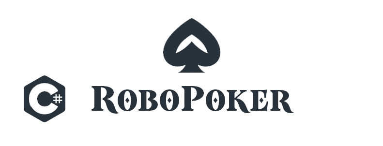

# RoboPoker

Рандомно-последовательная программа для выбора "опций" в покере (Техасский холдем).
Программа берёт рандомное действие либо число из базы данных и выводит его на экран.
Таким образом, вы сможете играть в покер, один дома.
Программа на C# работает точно так-же как и RoboPoker Script на Shell.

## Демонстрация программы

## Перед запуском

Для корректной работы программы, вам необходимо установить DotNet Framework 2.0, 3.5, 4.0 и выше!

Скачать и установить: [DotNet Framework](https://dotnet.microsoft.com/en-us/download/dotnet-framework)

## ENG

Random-sequential program for choosing "options" in poker (Texas Hold'em).
The program takes a random action or number from the database and displays it on the screen.
Thus, you can play poker, alone at home.
The program in C# works exactly the same as RoboPoker Script on Shell.

## Before launching

For the program to work correctly, you need to install DotNet Framework 2.0, 3.5, 4.0 and higher!

Download and install: [DotNet Framework](https://dotnet.microsoft.com/en-us/download/dotnet-framework)
