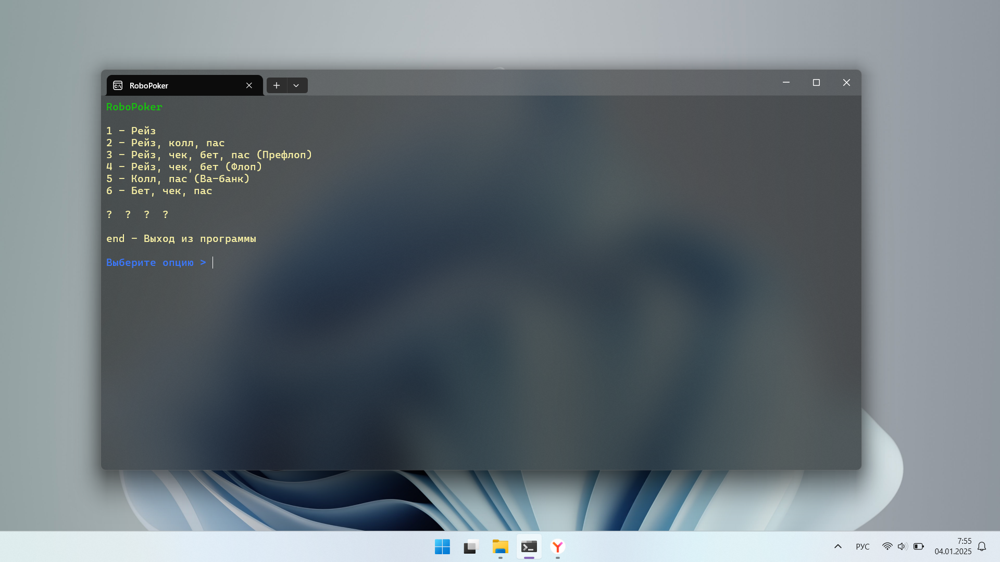

---

Random-sequential program for choosing "options" in poker (Texas Hold'em).
The program takes a random action or number from the database and displays it on the screen.
Thus, you can play poker, alone at home.

## Demonstration of the program

## Before launch

For the program to work correctly, you need to install DotNet Framework 2.0, 3.5, 4.0 and higher!

Download and install: [DotNet Framework](https://dotnet.microsoft.com/en-us/download/dotnet-framework)
